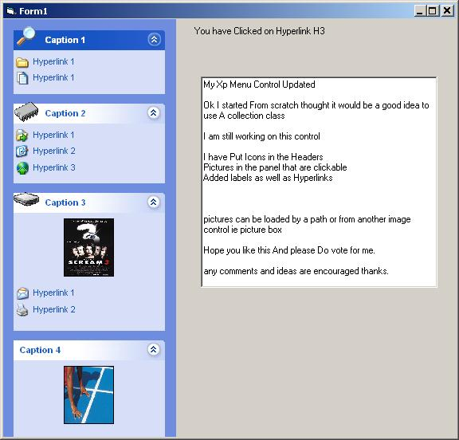



## XP SIDE MENU updated once again

### Description

I have updated once again

Working scrollbars,resizable at runtime,animated Roll affect on panels user can change speed,gradient background,one panel show property(when panel is clicked the other panels close except if panel state is set to Fixed)

check out my xp form skin control known as jsskin 1.4 at :

http://www.pscode.com/vb/scripts/ShowCode.asp?txtCodeId=34875&lngWId=1
 
### More Info
 

             |
---                |---
**Submitted On**   |2002-05-18 01:55:26
**By**             |[Marcel Jules Rymenhout](https://github.com/Planet-Source-Code/PSCIndex/blob/master/ByAuthor/marcel-jules-rymenhout.md)
**Level**          |Intermediate
**User Rating**    |4.8 (260 globes from 54 users)
**Compatibility**  |VB 5\.0, VB 6\.0
**Category**       |[Custom Controls/ Forms/  Menus](https://github.com/Planet-Source-Code/PSCIndex/blob/master/ByCategory/custom-controls-forms-menus__1-4.md)
**World**          |[Visual Basic](https://github.com/Planet-Source-Code/PSCIndex/blob/master/ByWorld/visual-basic.md)
**Archive File**   |[XP\_SIDE\_ME843695172002\.zip](https://github.com/Planet-Source-Code/marcel-jules-rymenhout-xp-side-menu-updated-once-again__1-34812/archive/master.zip)

